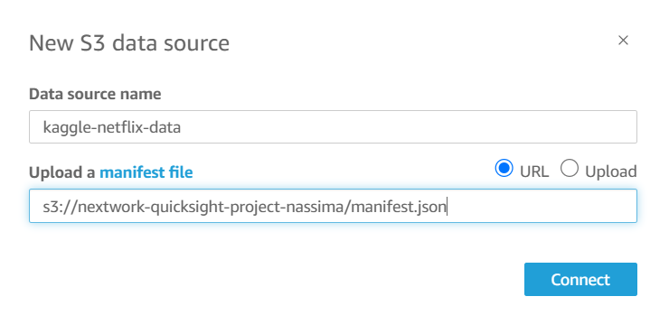

## __Visualize data with QuickSight__

### 1. Introducing Today's Project!

**What is Amazon QuickSight?**
Amazon QuickSight is a cloud-based BI tool by AWS. It helps users create
interactive dashboards and visualizations, making data analysis and decisionmaking easy and efficient with quick insights from various data sources.

**How I used Amazon QuickSight in this project**
In today's project, I used Amazon QuickSight to analyze a dataset of Netflix
movies and shows. I created visualizations to explore trends, such as release
year breakdowns, and customized the charts for clear insights.

**One thing I didn't expect in this project was...**
One thing I didn't expect in this project was how easy it was to create charts
and connect S3 with Amazon QuickSight. The seamless integration and
straightforward charting process made data visualization much more
accessible than anticipated.

**This project took me...**
The project took about 2 hours to complete, including time for creating
visualizations and preparing documentation.

### 2. Upload project files into S3

S3 is used in this project to store two files, which are the manifest.json and the
netflix_titles.csv.

I edited the manifest.json file by replacing the dataset **URL with s3://nextworkquicksight-project-nassima/netflix_titles.csv**. Itʼs important to edit this file to
ensure that the dataset is accessed.

### 3. Create QuickSight account:

Creating a QuickSight account cost 0 as long as you uncheck the Add
paginated reports while account creation.

Creating an account took me less than a minute.

### 4. Download the Dataset:

I connected the S3 bucket QuickSight by visiting Datasets Item from the vertical
navigation and choosing **New Dataset** then selecting **S3**.

The **manifest.json** file was important in this step because it contains the
necessary configuration that allows Amazon QuickSight to correctly locate and
interpret the dataset stored in my S3 bucket.

### 5. My first visualization:

To create visualizations on QuickSight, I first drag dataset fields from the lefthand panel into the appropriate sections of the graph. For example, I dragged
the release_year field into the Y-Axis heading.

This visualization provides a breakdown comparing the **total number of TV shows versus movies**, categorized by **release year**. It highlights how the production of each type has varied over time, offering insights into content trends.

### 6. Using filters:

Filters in visualizations are useful for narrowing down the dataset to focus on
specific information, removing unnecessary data, and making the insights more
relevant.

This visualization provides a breakdown of the **total number of titles** across
three specific **categories**: Action & Adventure, Thrillers, and TV Comedies,
starting from the **release year 2015** and onwards.

### 7. Setting up a dashboard:

As a finishing touch, I renamed the charts to ensure they were clear and
presentable. This step makes it easier for viewers to understand the purpose of
each visualization at a glance.

Did you know you could export your dashboard as PDFs too? I did this by
selecting the export option in QuickSight and choosing the PDF format. This
saves a high-quality, shareable version of the dashboard for offline viewing and
distribution.

Thank you to Nextwork Learning for your guidance 🙏.

